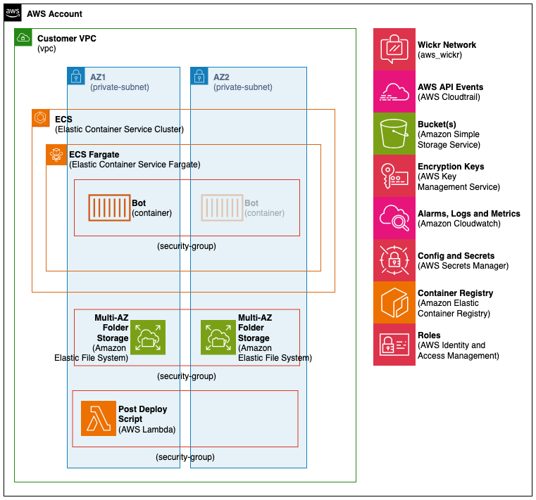

# Wickr Data Retention Bot - AWS CDK TypeScript Project

This project provides an automated solution for implementing Wickr data retention capabilities using AWS Cloud Development Kit (AWS CDK) with TypeScript. The bot integrates with AWS Wickr's data retention API to automatically capture, encrypt, and store messages to help achieve compliance with organizational data retention policies.

## Overview

This is sample code, for non-production usage. You should work with your security and legal teams to meet your organizational security, regulatory and compliance requirements before deployment.

The Wickr Data Retention Bot is designed to help organizations meet data retention compliance requirements by automatically archiving Wickr messages to AWS infrastructure. This solution leverages AWS services including AWS Lambda, Amazon Simple Storage Service (Amazon S3), AWS Secrets Manager, and other AWS resources to create a solution with enhanced security features and scalable data retention system.

### Key Features

- **Automated Message Capture**: Automatically captures messages from Wickr conversations
- **Message Storage**: Messages are encrypted and stored in Amazon S3 with enhanced security features and access controls
- **Compliance**: Designed to help meet data retention compliance requirements such as NIST SP 800-171, CMMC (Cybersecurity Maturity Model Certification), Defense Federal Acquisition Regulation Supplement (DFARS) 204.73, SOX, FedRAMP (Federal Risk and Authorization Management Program).
- **Scalable Architecture**: Built on AWS serverless technologies for automatic scaling
- **Easy Deployment**: Infrastructure as Code using AWS CDK for repeatable deployments

### Architecture Components

- **AWS Lambda**: Serverless functions to handle message processing and bot operations
- **Amazon S3**: Storage for retained messages and bot configuration files with enhanced security features
- **AWS Secrets Manager**: Storage with enhanced security features for bot credentials and sensitive configuration
- **AWS Identity and Access Management (IAM)**: Fine-grained access control and security policies
- **Amazon CloudWatch**: Monitoring and logging for operational visibility
- **Amazon Virtual Private Cloud (Amazon VPC)**: Provides isolated network environment with private subnets, enabling network-level security controls and traffic isolation.
- **AWS Fargate**: Serverless compute engine for containers, eliminating server management
- **Security Groups**: Virtual firewalls controlling network traffic between servers
- **AWS Key Management Service (AWS KMS)**: Customer-managed encryption keys for data at rest
- **Amazon Elastic File System (EFS)**: Shared storage for bot configuration and temporary files
- **Amazon Elastic Container Service (ECS)**: Container orchestration for running the Wickr bot application



## Prerequisites

Before you begin, ensure you have the following prerequisites installed and configured on your development machine:

### Required Software Dependencies

#### 1. Node.js (Version 18.x or later)

Node.js is required to run the CDK toolkit and manage project dependencies.

**Installation:**

- **macOS**: `brew install node` or download from [nodejs.org](https://nodejs.org/)
- **Linux**: Use your distribution's package manager or download from [nodejs.org](https://nodejs.org/)
- **Windows**: Download installer from [nodejs.org](https://nodejs.org/)

**Verify installation:**

```bash
node --version
npm --version
```

#### 2. AWS CDK (Cloud Development Kit)

The AWS CDK is a framework for defining cloud infrastructure using familiar programming languages.

**Installation:**

```bash
npm install -g aws-cdk
```

**Verify installation:**

```bash
cdk --version
```

#### 3. AWS Command Line Interface (AWS CLI)

Required for AWS authentication and account configuration.

**Installation:**

- **macOS**: `brew install awscli` or download from [AWS CLI installation guide](https://docs.aws.amazon.com/cli/latest/userguide/getting-started-install.html)
- **Linux**: Follow the [AWS CLI installation guide](https://docs.aws.amazon.com/cli/latest/userguide/getting-started-install.html)
- **Windows**: Download installer from [AWS CLI installation guide](https://docs.aws.amazon.com/cli/latest/userguide/getting-started-install.html)

**Verify installation:**

```bash
aws --version
```

### AWS Account Setup

#### 1. AWS Account Configuration

Ensure you have:

- An active AWS account with required permissions
- AWS CLI configured with your credentials
- Required permissions to create IAM roles, AWS Lambda functions, Amazon S3 buckets, and other AWS resources

**Configure AWS CLI:**

```bash
aws configure
```

You'll need to provide:

- AWS Access Key ID
- AWS Secret Access Key
- Default region (e.g., us-east-1)
- Default output format (json recommended)

#### 2. CDK Bootstrap

Bootstrap your AWS account for CDK deployments (run this once per account/region):

```bash
cdk bootstrap aws://ACCOUNT-NUMBER/REGION
```

Example:

```bash
cdk bootstrap aws://123456789012/us-east-1
```

## Installation and Setup

### 1. Clone and Setup Project

```bash
# Clone the repository (if applicable)
git clone <repository-url>
cd Wickr-DataRetention-Bot

# Install project dependencies
npm install
```

This command installs all required Node.js packages including:

- AWS CDK libraries
- TypeScript compiler and type definitions
- Testing frameworks
- Utility libraries

### 2. Verify Installation

#### Test CDK Installation

Verify CDK is working correctly:

```bash
npx cdk list
```

**Note**: Do not run `npx cdk synth` until after updating the configuration file, as it will fail with the default placeholder values.

## Configuration

### Environment Configuration

Before deployment, you must configure the application for your specific AWS environment and requirements.

#### 1. Obtain Wickr Data Retention Bot ID

Before updating the configuration file, you need to obtain the Data Retention Bot ID from the Wickr console.

**Steps to get the Bot ID:**

1. **Access Wickr Admin Console**:

   - Log into your AWS account
   - Navigate to the Wickr service in the AWS Console
   - Click on your Wickr Network
   - Click on "Wickr Admin Console"

2. **Navigate to Data Retention Settings**:

   - In the Wickr Admin Console, look for "Data Retention" under "Network Settings" in the navigation menu
   - Click on "Data Retention" to access the configuration page

3. **Locate the Bot ID**:
   - On the Data Retention page, look for "Bot ID" or "Data Retention Bot ID"
   - The Bot ID will be in the format: `compliance_XXXXXXXX_bot` (where X represents numbers)
   - Copy this Bot ID - you'll need it for the configuration file

#### 2. Update Configuration File

Edit the configuration file located at `bin/config.ts` with your specific settings.

**For detailed documentation on each configuration option:**

- See `types/config.ts` for comprehensive documentation with AWS service links
- Hover over any property in your IDE to see detailed explanations
- Each option includes usage guidelines, examples, and links to AWS documentation

**Key configuration values to update:**

```typescript
const config: WickrConfig = {
  // Your 12-digit AWS Account ID
  accountId: '123456789012',

  // AWS Region for deployment
  region: 'us-east-1',

  // Unique prefix for resource names
  prefix: 'wickr-drb-myorg',

  // Your existing VPC ID
  vpcId: 'vpc-abc123',

  // Your existing private subnet IDs
  subnetIds: ['subnet-123', 'subnet-456'],

  // Your bot ID from Wickr Admin Console
  wickrBotName: 'compliance_XXXXXXXX_bot'

  // See types/config.ts for all available options with detailed documentation
};
```

#### 3. Validate Configuration

**Important**: Only run this after updating your configuration with real values.

After updating the configuration, validate it by running:

```bash
npx cdk synth
npx cdk list
```

These commands:

- Generate CloudFormation templates
- Validate your CDK code for syntax errors
- Show you all the resources that will be created with your configuration
- Show you the list of the Stacks that will be created with your configuration

## Deployment Process

The deployment process consists of multiple phases to ensure proper setup and security. Follow these steps in order:

### Phase 1: Deploy Prerequisites Stack

The prerequisites stack creates foundational resources required by the main application stack.

#### What This Stack Creates:

- IAM roles and policies for the bot
- Amazon S3 bucket for data retention storage
- AWS Secrets Manager secret for bot configuration
- Amazon CloudWatch log groups for monitoring
- AWS KMS keys for encryption

#### Deploy Prerequisites:

```bash
npx cdk deploy WickrDRBPreReqStack --require-approval never
```

### Phase 2: Manual Configuration Tasks

Between stack deployments, you must complete several manual configuration steps to integrate with Wickr.

#### Step 1: Obtain Bot Password from Wickr

**Why this step is necessary**: Wickr requires a password for bot authentication that must be generated through their admin console.

**Detailed Instructions**:

1. **Access Wickr Admin Console**:

   - Log into your AWS account
   - Navigate to the Wickr service in the AWS Console
   - Click on your Wickr Network
   - Click on "Wickr Admin Console"

2. **Navigate to Data Retention Settings**:

   - In the Wickr Admin Console, look for "Data Retention" under "Network Settings" in the navigation menu
   - Click on "Data Retention" to access the configuration page

3. **Generate/Obtain Initial Password**:
   - Look for an "Initial Password" field or "Generate Password" button
   - If no password exists, click "Generate Password" to create one
   - Copy the generated password - you'll need it in the next step

#### Step 2: Update AWS Secrets Manager

**Why this step is necessary**: The bot needs access to the Wickr password, which is stored in AWS Secrets Manager for security.

**Detailed Instructions**:

1. **Navigate to AWS Secrets Manager**:

   - In your AWS Console, go to AWS Secrets Manager
   - Ensure you're in the same region where you deployed the prerequisites stack

2. **Find the Data Retention Secret**:

   - Look for a secret named: `{your-prefix}-data-retention-config`
   - Example: If your prefix is "myorg-wickr-drb", look for "myorg-wickr-drb-data-retention-config"
   - Click on the secret name to open its details

3. **Update the Secret Value**:

   - Click "Retrieve secret value" to view current contents
   - Click "Edit" to modify the secret
   - Update the `password` field with the Initial Password from Wickr
   - Click "Save" to store the updated secret

**Important Security Notes**:

- Wickr does not have an API to do this automatically, so human intervention is required
- Never store this password in plain text files or version control
- The initial password is only used for the first connection; the bot will handle password thereafter

### Phase 3: Deploy Main Bot Stack

After completing the manual configuration tasks, deploy the main bot stack that contains the core application logic.

#### What This Stack Creates:

- AWS Lambda functions for bot operations
- Amazon CloudWatch alarms and monitoring
- ECS Service
- Additional IAM policies for bot operations

#### Deploy Main Stack:

```bash
npx cdk deploy WickrDRBStack --require-approval never
```

### Phase 4: Post-Deployment Configuration

After successful deployment of both stacks, complete these final configuration steps to activate the data retention system.

#### Step 1: Obtain and Distribute Public Key

**Why this step is necessary**: Users need the bot's public key to verify they are connecting to the correct data retention bot. This prevents man-in-the-middle attacks and ensures users are not accidentally using the wrong data retention bot.

**Detailed Instructions**:

1. **Access the S3 Bucket**:

   - Navigate to Amazon S3 in your AWS Console
   - Find the bucket named: `{your-prefix}-data-retention`
   - Example: "myorg-wickr-drb-data-retention"

2. **Download the Public Key**:

   - Look for a file named `bot_public_key.txt` in the bucket
   - Click on the file name to view details
   - Click "Download" to save the file to your local machine
   - Alternatively, use AWS CLI:

   ```bash
   aws s3 cp s3://{your-prefix}-data-retention/bot_public_key.txt ./bot_public_key.txt
   ```

3. **Distribute to Users**:
   - **Internal Distribution**: Share the public key content through your organization's approved channels
   - **Documentation**: Include the public key in your Wickr installation documentation
   - **Storage**: Store the public key in your organization's certificate/key management system
   - **User Instructions**: Provide clear instructions on how users should use this key during Wickr client installation

**Sample Distribution Methods**:

- Internal wiki or documentation system
- Email to IT administrators
- Corporate intranet download
- Include in Wickr client deployment packages

#### Step 2: Activate Data Retention in Wickr

**Why this step is necessary**: Data retention must be explicitly activated in the Wickr admin console to begin capturing messages.

**Detailed Instructions**:

1. **Access Wickr Admin Console**:

   - Return to the Wickr service in your AWS Console
   - Click on your Wickr Network
   - Click on "Wickr Admin Console"

2. **Activate Data Retention**:

   - Look for a toggle switch or "Activate" button for Data Retention
   - Click to enable data retention
   - **Important**: This action will begin capturing messages immediately
   - Confirm the activation when prompted

3. **Verify Activation**:
   - Check that the status shows "Active" or "Enabled"
   - Monitor for any error messages or warnings
   - Test with a sample message to ensure retention is working

#### Step 3: Verify End-to-End Functionality

**Test the Complete System**:

1. **Send Test Messages**:

   - Have users send test messages in Wickr
   - Wait a few minutes for processing

2. **Check S3 Storage**:

   ```bash
   # List objects in the retention bucket
   aws s3 ls s3://{your-prefix}-data-retention/ --recursive
   ```

3. **Monitor Amazon CloudWatch Metrics**:

   - Navigate to Amazon CloudWatch in your AWS Console
   - Go to "Metrics" and look for the "WickrIO" namespace
   - Monitor bot performance and message processing metrics

4. **Verify Encryption**:
   - Confirm that stored messages are encrypted
   - Test that messages can be decrypted with proper keys

## Troubleshooting Common Issues

#### Bot Authentication Failures

- Check AWS Secrets Manager for correct credentials
- Verify Wickr network configuration

#### Message Retention Not Working

- Verify data retention is activated in Wickr console
- Check bot logs in ECS console under Amazon CloudWatch logs

#### High Costs or Storage Issues

- Review S3 lifecycle policies
- Monitor data retention volume
- Consider archiving old data to Glacier

## Message Decryption Utility

A command-line utility to decrypt messages stored by the Wickr Data Retention Bot from AWS S3.

For detailed instructions, see [utils/README.md](utils/README.md).

### Prerequisites

- Python 3.9+
- AWS CLI configured with required permissions
- Access to the S3 bucket containing encrypted messages
- AWS KMS decrypt permissions for the data encryption key

### Security Notes

- Only authorized personnel should use the utility
- Follow organizational data handling policies

## Security Considerations

### Data Protection

- All retained messages are encrypted at rest with with AWS KMS Customer Managed Key
- Access to retained data requires required IAM permissions
- Bot credentials are stored in AWS Secrets Manager with AWS KMS Customer Managed Key
- Bot configuration is stored in AWS Secrets Manager with AWS KMS Customer Managed Key

### Compliance

- Configure retention periods according to your compliance requirements
- Implement proper access logging and auditing
- Ensure data residency requirements are met through proper region selection

### Access Control

- Use least-privilege IAM policies
- Regularly audit access to retained data
- Implement multi-factor authentication for administrative access

## Support and Resources

### Documentation

- AWS CDK Documentation: https://docs.aws.amazon.com/cdk/
- Wickr Documentation: https://docs.aws.amazon.com/wickr/latest/adminguide/data-retention.html
- AWS Best Practices: https://aws.amazon.com/architecture/well-architected/
